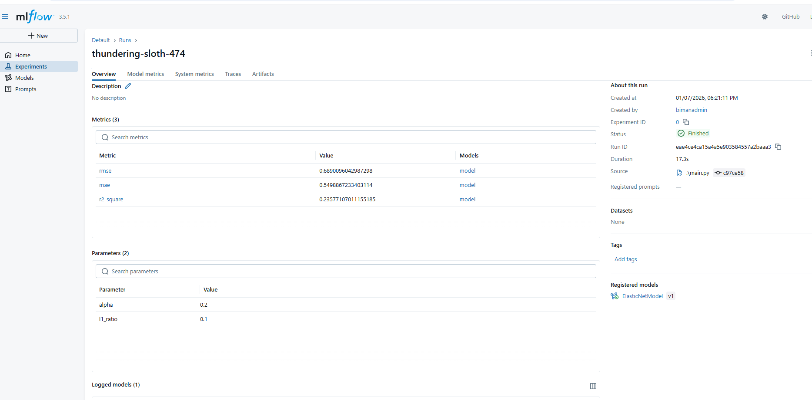
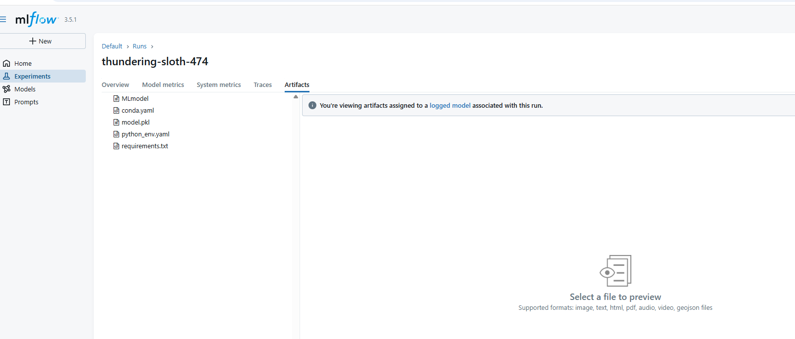
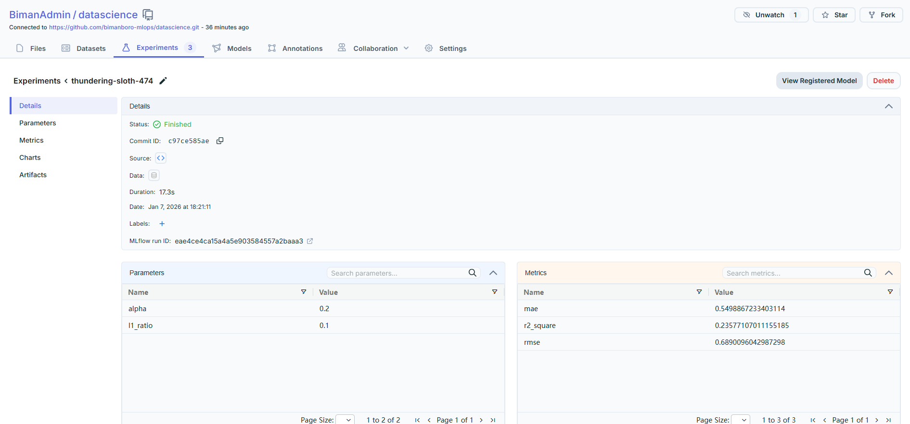

# datascience
## This project Data basically Checks the Wine Quality
### Workflows--ML Pipeline

1. Data Ingestion
2. Data Validation
3. Data Transformation-- Feature Engineering,Data Preprocessing
4. Model Trainer
5. Model Evaluation- MLFLOW,Dagshub

